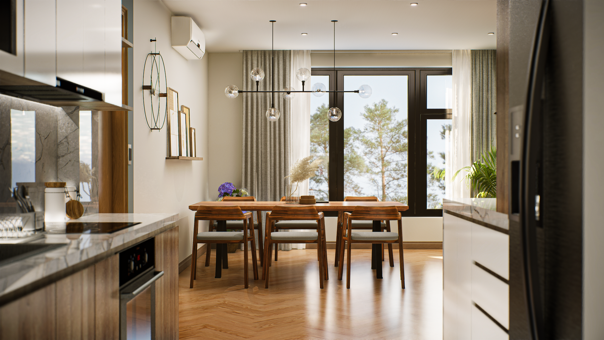
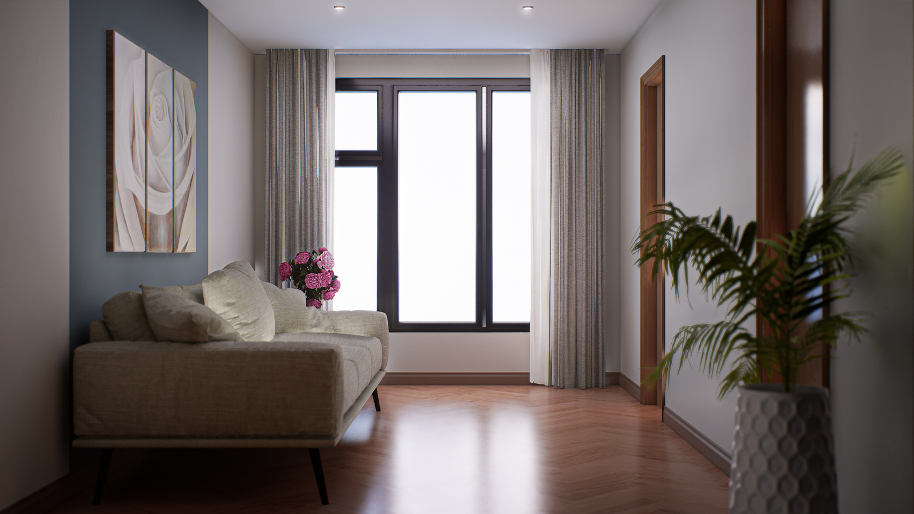
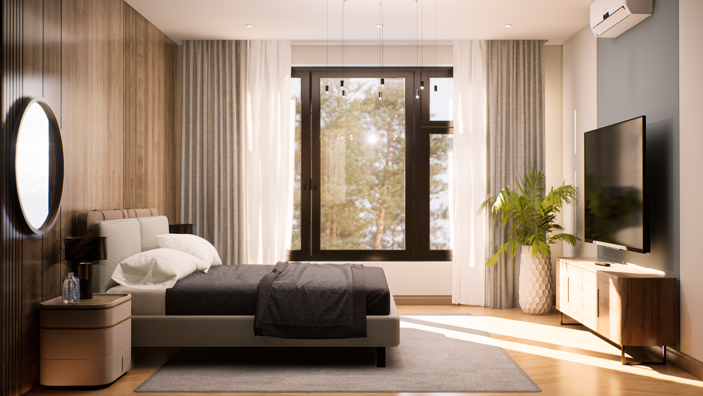
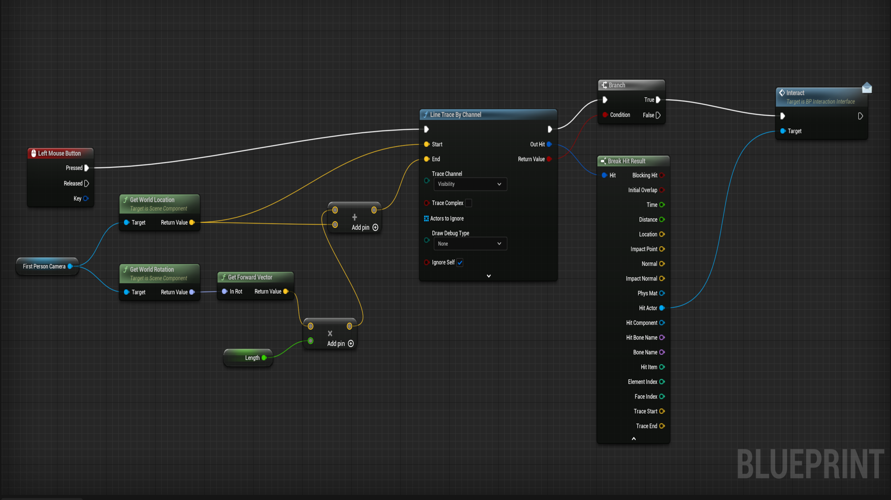
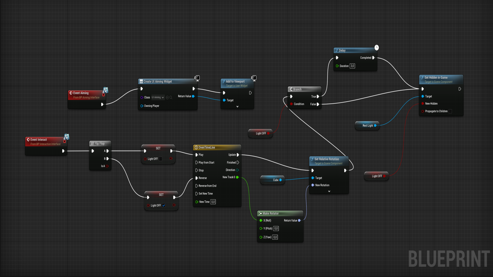
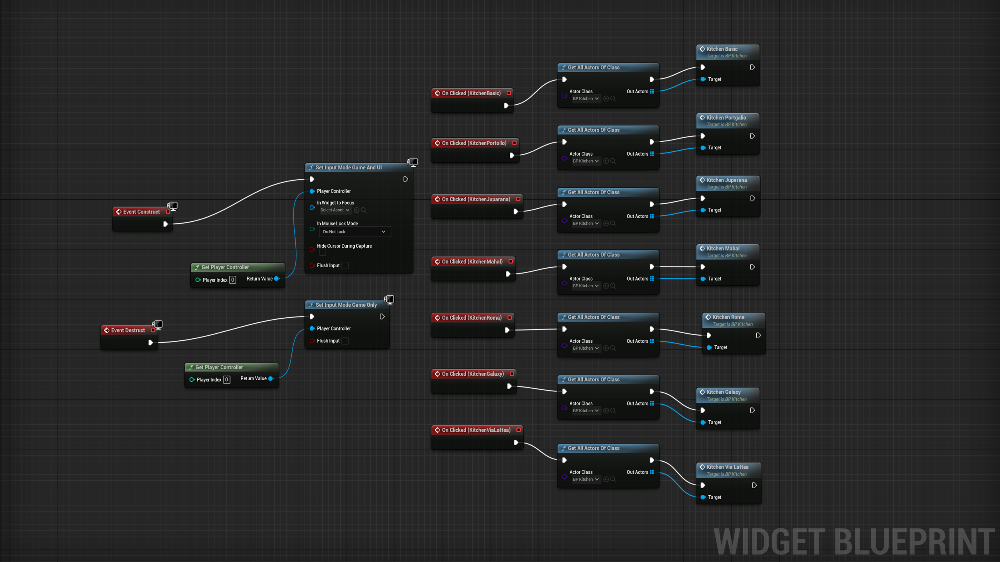
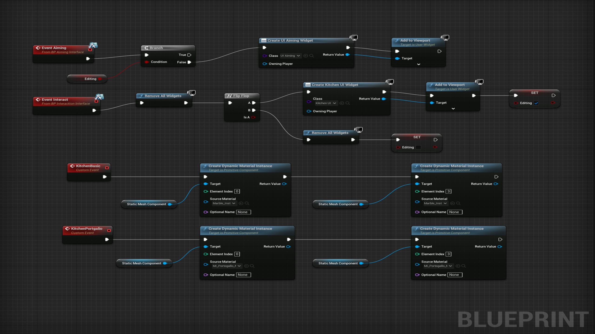

# ue5-interactive-render

Este es un render interactivo de un departamento creado en un motor de videojuegos como parte de mi experiencia previa como renderista y ahora forma parte de mi portafolio como desarrollador.

## Características

- Recreación del ambiente con realismo fotográfico.
- Permite explorar libremente sin rutas predefinidas.
- Interactúa con objetos como puertas, lámparas y canillas.
- Personaliza los acabados de pintura, pisos y mesadas al interactuar con el entorno.
- Experimenta cambios de iluminación en tiempo real al interactuar con las teclas o las cortinas.

## Tecnologías utilizadas

- Modelado 3D: SketchUp.
- Motor de videojuegos: Unreal Engine 5 (Lumen).
- Implementación de la interactividad: Unreal Engine Blueprints.

## Videos

- Demostración: https://youtu.be/7X-eYt_Ll30
- Cinematográfico: https://youtu.be/jFY9ru9SmYc

## Demostración para Windows:

1. Descargar el archivo desde el siguiente enlace:

- https://drive.google.com/file/d/1gCEyTH4SarvPQxqU7l2hbXpaLNApfR7k/view?usp=sharing

2. Descomprimir el archivo `ue5-render-interactive.zip`.
3. Acceder a la carpeta `ue5-interactive-render`.
4. Ejecutar el archivo `InteractiveRender.exe`.

## Requerimientos minimos:

- Sistema Operativo: Windows 10 de 64 bits.
- Procesador AMD Ryzen 5 o Intel Core i5 con al menos 4 núcleos.
- Memoria RAM: 16 GB.
- Tarjeta Gráfica: Tarjeta gráfica de gama alta con al menos 8 GB de VRAM y soporte para DirectX 12.
- Almacenamiento: Unidad de estado sólido (SSD) de alta velocidad y capacidad para una carga rápida de activos y texturas.

## Capturas de pantalla

  
  
  
  
  
  
  
  
  
  

## Blueprints

  
  
  
  
  
  
  
  
  
  

Made by Hernán Hawryluk - www.linkedin.com/in/hernan-hawryluk
