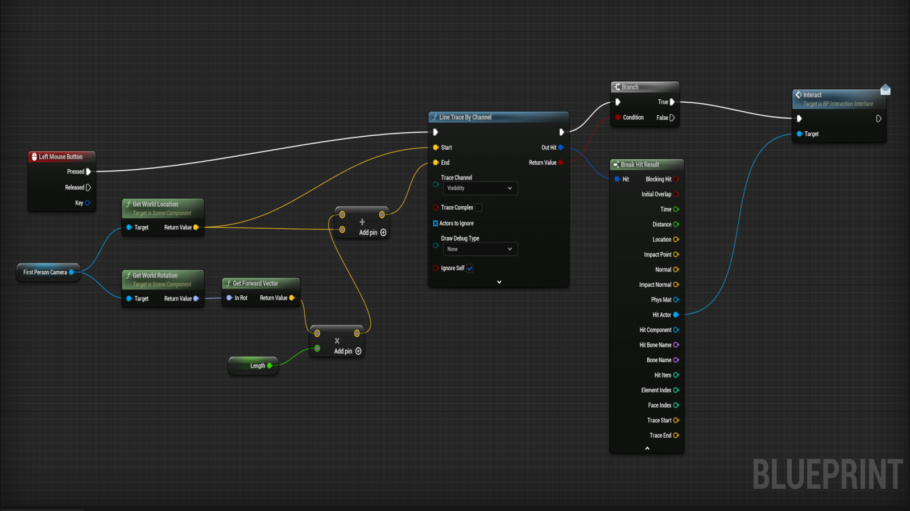
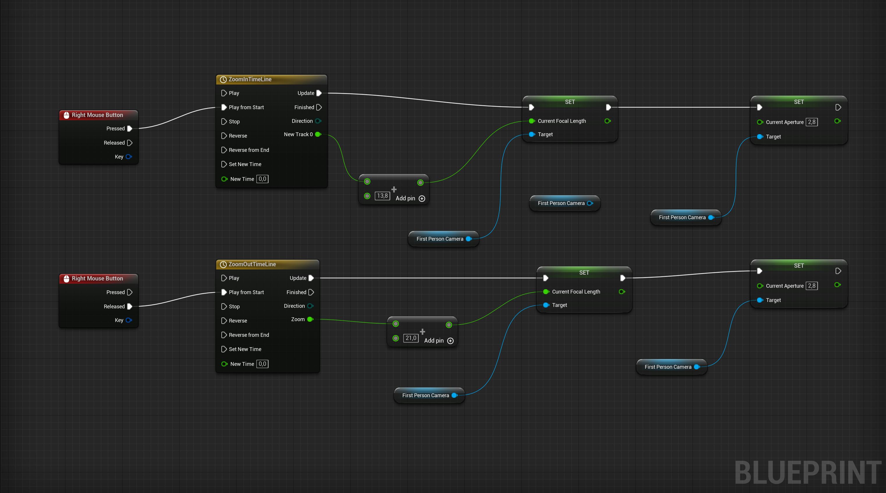
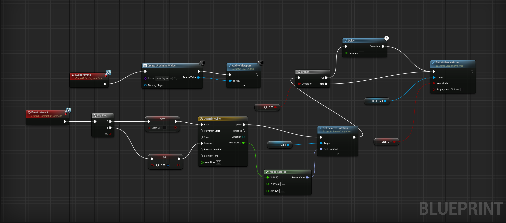
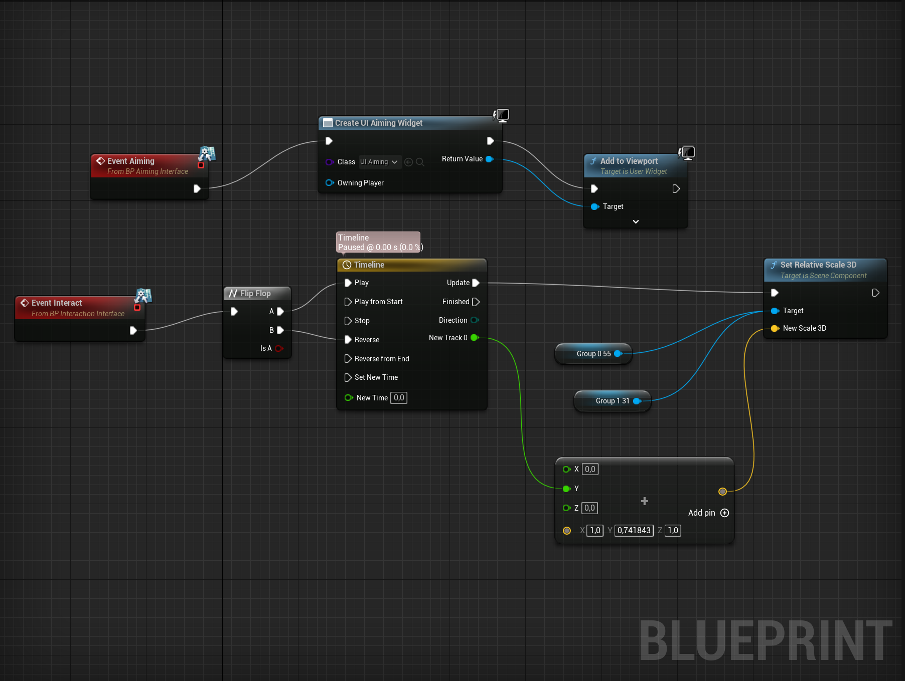
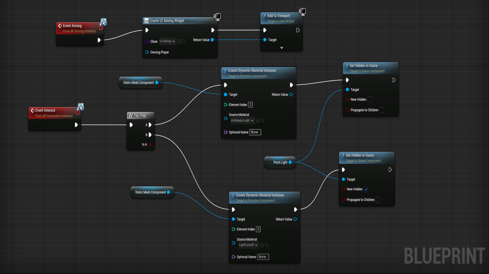
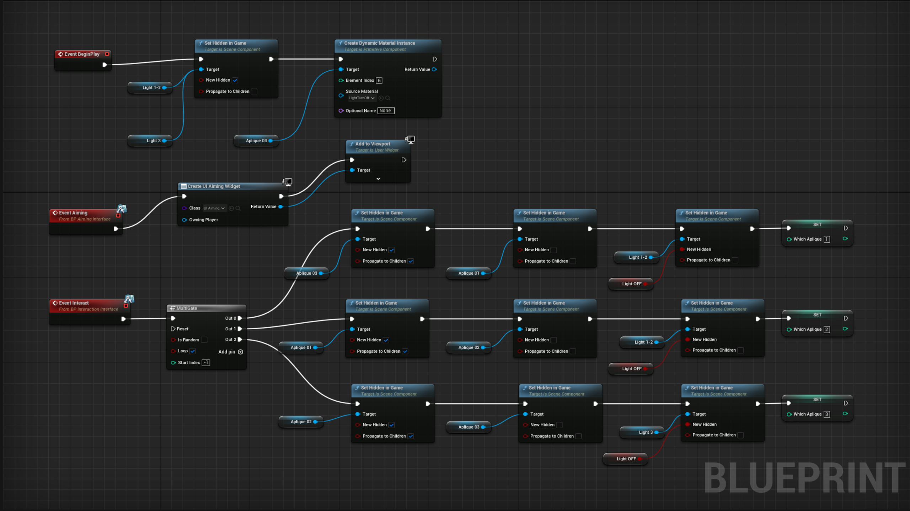
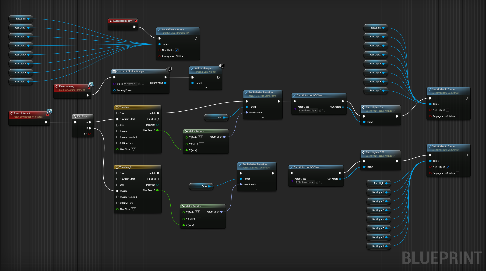
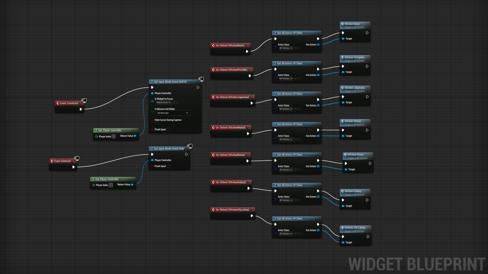
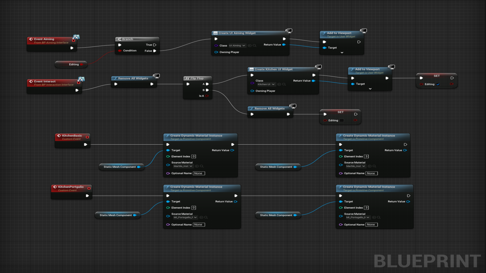

# ue5-interactive-render

Este es un render interactivo de un departamento creado en un motor de videojuegos como parte de mi experiencia previa como renderista y ahora forma parte de mi portafolio como desarrollador.

This is an interactive rendering of an apartment created in a video game engine, as part of my previous experience as a renderer and now a part of my developer portfolio.

## Características

- Recreación del ambiente con realismo fotográfico.
- Permite explorar libremente sin rutas predefinidas.
- Interactúa con objetos como puertas, lámparas y canillas.
- Personaliza los acabados de pintura, pisos y mesadas al interactuar con el entorno.
- Experimenta cambios de iluminación en tiempo real al interactuar con las teclas o las cortinas.

## Tecnologías utilizadas

- Modelado 3D: SketchUp.
- Motor de videojuegos: Unreal Engine 5 (Lumen).
- Implementación de la interactividad: Unreal Engine Blueprints.

## Video

- Soon

## Capturas de pantalla

  
  
  
  
  
  
  
  
  
  

## Blueprints

Made by Hernán Hawryluk - www.linkedin.com/in/hernan-hawryluk
